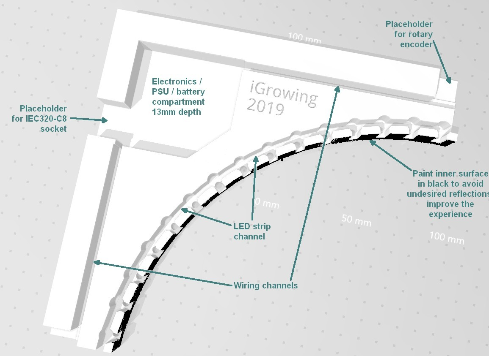
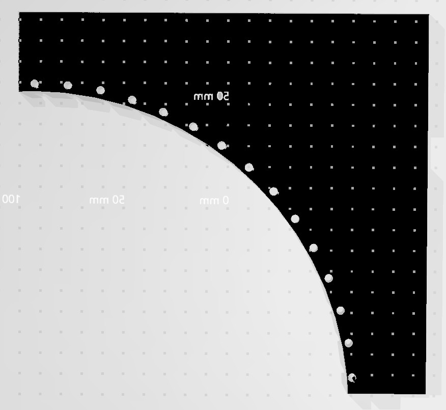

# Infinity Mirror Clock

This repo follows and inspired by http://barkengmad.com/rise-and-shine-led-clock/

Original Morgan Barke's video:


I like the original inifinity clock after reviewing dosen (or even more) similar devices. I appreciate Morgan's creativity and generosity making his project public. Sharing is caring, and I'm giving back :)

This project fixes few issues in original clock and improves usability, user experience, and build ease.

# Features
- 8 modes of _clock_ display.
- 3 modes of _alarm_ display.
- Minute discrete timer.
- Demo mode.
- Buzzer.
- Power independent time count and settings store.
- WOW effect :)

# Usage
See the PDF chart.
```
TODO: Update the chart with rotation settings and with exit from Alarm/Timer modes.
```

The clock consumes about 1.5A @ 5V in worst case (white demo). Therefore, usual 2A USB charger is enough to power it up.

# Changes vs. original clock
- Clock can be rotated by 90 degrees. This is useful for displaying the clock with the knob on the top (like traditional stopwatch) or on the right side (like tratitional watch).
- Move rotary button from A3 to D4: this helps ease of assembly. This change is *not shown* in the breadboard PNG.
- Use RTC NVRAM instead of EEPROM: this saves EEPROM wear out.
- Refactor menu button work. Less code, easy readable.
- Keep clock mode and restore it after power failure.
- Refactor and make stable the rotary encoder.
- Breathing clock is more distinctive.
- Buzzer in Alarm and Timer modes.
- Remove excessive Serial prints.
- New Starry night clock mode.
- About 25% less code lines.
- Numerous bugs fixed.

# Build/compile
## Software
Original clock comes with libraries in archive. The libraries are outdated. Install in your Arduino/Platformio environment following libraries _before_ compiling:
- FastLED v3.2.1 and up
- Bounce2
- RTCLib
- Encoder of Paul Stoffregen
- EasyBuzzer

Likely, following libs are preinstalled by default:
- Wire

> Important: For some reason, the PlatformIO couldn't pick the EasyBuzzer. I guess this is related to [known bug of PlatformIO](https://community.platformio.org/t/platformio-home-page-cant-open/2768). Since numerous attempts to fix it failed, I switched to [command line control of libraries and boards](https://docs.platformio.org/en/latest/userguide/lib/index.html). So far it worked well, except the EasyBuzzer. Therefore, I added it to this repo: it will be easier to compile the entire project.

## Mechanics


Beside electronic components following material is needed:
- Knob for rotary encoder. 6mm inner diameter, the rest is on your taste. From 1.5 to 18 USD on eBay.
- Base plate made of layered wood or plastic for the back, 4-6mm thick, 38x38cm.
- PMMA or polycarbonate sheet for the front, 2.5-3mm thick, 38x38cm.
- Half-transparent mirror, found on Amazon.
- Non-transparent mirror, found on Amazon.
- Frame on your taste from local painting shop.
- Wood or plastic for 3D model CNC milling. 16mm thick, 210x210mm (will be milled smaller). For CNC machine take 2-flute 20mm CEL carbide milling bits of 1/8".
or
- PETG or ABS filament for 3D printing, white color. PLA is good enough too, however, it's weak and thin part might break during handling/assembly.



It's hard to find large enough 3D printing service or CNC milling service. So I split the clock to 4 equal parts. Connect them side to side. Insert all electronics/wires in the channels. Place the back base with non-transparent mirror on all 4 parts connected. And screw all together.

Remember to paint the front side of the 3D model and inner ring with black. This stops unwanted repflections and improves the user experience (WOW effect).

Per spare compartments: normally 1 compartment is populated with arduino electronics and other with PSU. In theory, 3 compartments can be used for 14400 Li-Ion or AAA Ni-MH batteries. Batteries might provide backup power up to 20 hours. I run my clock from AC mains.

# TODO
- Move alarm to RTC. This allows daily alarm.
